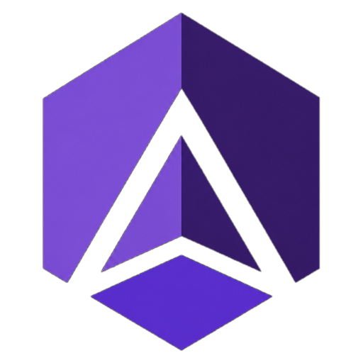
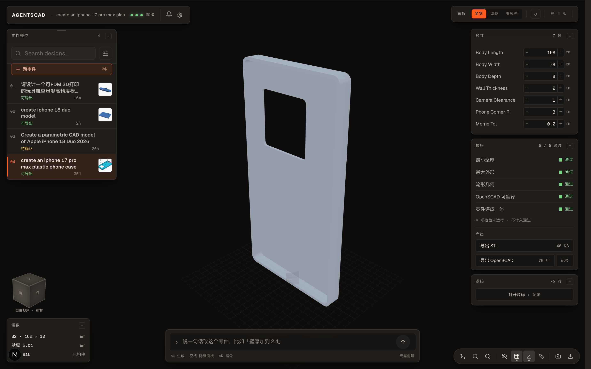
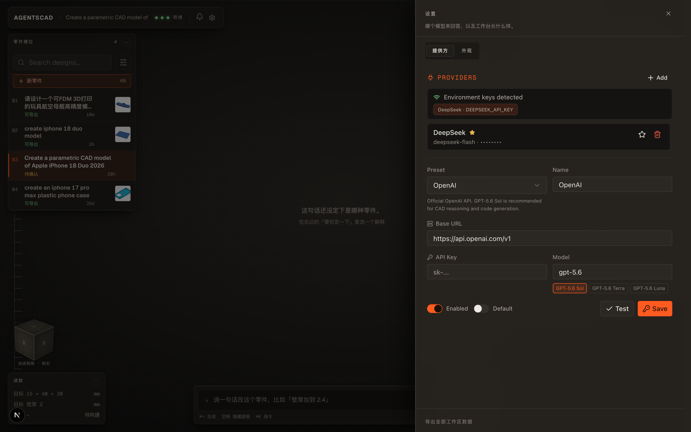

**English** | [中文](./README_CN.md)

<p align="center">
  
</p>

<h1 align="center">AgentSCAD</h1>

<p align="center">
  <strong>Engineering control room for CAD job orchestration.</strong>
</p>

<p align="center">
  
  
  
  
  
</p>

AgentSCAD is a local-first, open-source parametric CAD web app. Run it, add your own LLM provider/API key in the browser, and turn natural-language requests into editable OpenSCAD, rendered STL/PNG artifacts, and validation evidence.

**Live Demo:** [https://agentscad.vercel.app](https://agentscad.vercel.app)

There is no account system. In local mode, jobs live in SQLite, artifacts stay on the local filesystem, and provider settings stay in the local `.agentscad/` directory. OpenSCAD is the core CAD engine: AgentSCAD uses an LLM to interpret the request and write or repair SCAD, then uses native or WASM OpenSCAD to produce real geometry. Deterministic validators inspect measurable mesh/manufacturing facts; an optional vision-capable model can review the preview against the request.



> The diagram describes the intended end-to-end product loop. In the current runtime, visual review is user-triggered, `DELIVERED` means artifacts are available rather than user-accepted, and learned prompt memory is experimental and local-only. See [Architecture](./docs/ARCHITECTURE.md), [Benchmarking](./docs/BENCHMARK.md), and [Memory](./docs/MEMORY.md) for the exact current boundaries.

## Demo Flow





## 60-Second Overview

- AgentSCAD turns natural-language CAD requests into `model.scad`, `model.stl`, `preview.png`, validation results, and local job history.
- Bring your own provider key. The normal product path is **Settings → Providers → Test → Save**, then create a job with the configured model.
- OpenSCAD is always the geometry authority. Use the native CLI locally or the checksum-pinned official WASM CLI in serverless/explicit WASM mode.
- LLMs handle interpretation, SCAD generation, repair, chat, and optional visual review. Deterministic tools handle rendering, artifact IO, parameter extraction, and measurable mesh/manufacturing checks.
- Without a provider key, the UI and deterministic CAD tooling still run, and four known part families have a template fallback. That fallback is for diagnostics and local exploration, not representative AI CAD quality.
- Code entry points: `src/lib/pipeline/execute-cad-job.ts`, `src/lib/tools/`, `src/components/cad/`, `src/app/api/`, `prisma/schema.prisma`, and `skills/`.

## Prerequisites

Before you start, you need three tools installed:

| Tool | Required for | Install |
|---|---|---|
| **Node.js 20 or 22 LTS** | Next.js app | [nodejs.org](https://nodejs.org) |
| **Bun** | package manager & scripts | `curl -fsSL https://bun.sh/install \| bash` |
| **OpenSCAD execution backend** | compiling SCAD and rendering real STL/PNG artifacts | Install the [native CLI](https://openscad.org/downloads.html), or use the verified WASM backend |

> [!IMPORTANT]
> OpenSCAD is a core runtime dependency, not an optional validator. Local native rendering resolves `OPENSCAD_BIN` or `openscad`; serverless deployments and `AGENTSCAD_OPENSCAD_BACKEND=wasm` use the checksum-pinned official OpenSCAD WebAssembly CLI.

## Quick Start

### Option A: Docker Compose

Docker Compose brings up the production-built web app and SQLite-backed workspace:

```bash
cp .env.example .env
mkdir -p db public/artifacts
docker compose up --build
```

Open [http://localhost:3000](http://localhost:3000).

Docker initializes the Prisma SQLite schema before starting the app and defaults
to the bundled, verified OpenSCAD WASM backend. Set
`AGENTSCAD_OPENSCAD_BACKEND=native` only when the image also provides a working
native `OPENSCAD_BIN`.

### Option B: Local Development

Requirements: Node.js 20 or 22 LTS, Bun, and OpenSCAD in your PATH (see [Prerequisites](#prerequisites) above).

```bash
bun install --frozen-lockfile
test -f .env || cp .env.example .env
mkdir -p db
touch db/dev.db
bun run db:push
bun run doctor
bun run dev
```

Open [http://localhost:3000](http://localhost:3000).

Then open **Settings → Providers**, choose a preset or custom OpenAI-compatible endpoint, paste your own API key, select a model, click **Test**, and click **Save**. Local development writes that configuration to `.agentscad/providers.json` on your machine. Do not use a shared local installation with secrets in that file.

Windows setup and extended commands are in [Development and CI](./docs/DEVELOPMENT.md).

### Option C: Vercel MVP

Use this when you want the app online quickly. Docker is not required for the Vercel-hosted MVP.

1. Import the repo into Vercel.
2. Add Vercel Postgres, Neon, or Supabase Postgres and set `DATABASE_URL`.
3. Keep the default Vercel build settings from `vercel.json`:

```bash
bun run build
```

4. Generate a Provider Settings encryption secret with `openssl rand -base64 48`, save it as `PROVIDER_SETTINGS_SECRET` in **Vercel Project Settings → Environment Variables**, then redeploy.
5. In the live workspace, open **Settings → Providers**, enter your provider key, test it, and click **Save**.
6. Do not add shared model-provider keys to a public deployment. Without `API_SECRET`, AgentSCAD ignores environment-backed provider credentials; each visitor supplies a key through encrypted browser-session settings. A private administrative deployment may set both `API_SECRET` and environment-backed provider keys.
7. Add Vercel Blob and `BLOB_READ_WRITE_TOKEN`. Serverless rendering uses it
   for durable STL/PNG artifacts and deployment-wide capacity enforcement.

The MVP supports the online workspace, job history, SCAD generation, editing,
and chat with Postgres-backed jobs. Keys saved through Provider Settings are
encrypted in an HttpOnly browser-session cookie, are not shared with other
visitors, and are not written to Vercel's read-only filesystem or database.
Use **Clear keys** before leaving a shared device; browser session restoration
behavior varies, so closing a tab alone is not a guaranteed credential wipe.
Vercel renders STL with the official OpenSCAD WebAssembly CLI and creates a PNG
preview from that mesh. Each renderer child receives no application secrets,
runs in a fresh empty working directory with host filesystem access denied, has
explicit JavaScript/WASM memory caps and wall-clock/output limits, and participates in a
Blob-backed global limit of 20 render starts per minute.

## First-Run Walkthrough

1. Start the app with Docker Compose or `bun run dev` (`dev:all` is currently a compatibility alias).
2. Open [http://localhost:3000](http://localhost:3000).
3. In **Settings → Providers**, add and test your own provider/API key.
4. Create a new job with:

```text
Create a wall-mountable phone holder with rounded corners and two screw holes.
```

5. Pick the configured model.
6. Inspect the preview, STL readiness, SCAD source, validation report, and editable parameters.
7. Change a parameter such as wall thickness or screw-hole diameter, re-render, then export the STL.

## Expected Result

After creating and processing a job, you should see:

- generated `model.scad`
- rendered `model.stl`
- rendered `preview.png`
- validation status and report
- editable parameters extracted from top-level SCAD assignments
- job history / version information
- repair, visual repair, re-render, or export actions when the job state supports them

Without a provider key, you can still inspect the UI, initialize the database, edit SCAD/parameters, inspect local artifacts, and run deterministic rendering/validation. If model generation fails, the current pipeline falls back to template-style parametric generation only for its supported families; the event stream identifies that path as `generating_mock`.

## Provider Key Boundary

### Works without a provider key

- open the workspace UI
- initialize SQLite with Prisma
- inspect existing/local artifacts
- edit SCAD and extracted parameters
- run OpenSCAD rendering if OpenSCAD is installed and reachable through `OPENSCAD_BIN` or `openscad`
- run deterministic mesh/manufacturing validation after an STL exists
- use the limited fallback/template CAD generation paths when model calls are unavailable

### Requires a working provider/model

- full LLM-backed CAD generation quality
- automatic LLM repair after validation failure
- chat help beyond local fallback responses
- user-triggered visual repair / VLM review with a vision-capable configured model

Visual validation is skipped in the normal pipeline unless explicitly requested. Missing visual-provider support is treated as uncertainty in delivery readiness, not evidence that the design matches the request.

## Try This Sample Job

```text
Create a wall-mountable phone holder with rounded corners and two screw holes.
```

Expected artifacts:

- `model.scad`
- `model.stl`
- `preview.png`
- validation report
- editable parameters

Without provider keys, generated geometry may come from the template fallback path. That is still useful for evaluating the workflow, artifacts, and deterministic checks, but not a substitute for reviewing model-backed CAD quality.

## Features

- **Artifact-first CAD generation**: OpenSCAD source is the source of truth.
- **Cost-aware defaults**: deterministic intake first; index-unknown requests use one short intake call before generation; one repair attempt only on failure; visual repair only when user-triggered.
- **Deterministic CAD tooling**: OpenSCAD renders STL/PNG artifacts; Python/trimesh checks rendered meshes.
- **Parametric editing**: extracted SCAD assignments become editable constrained parameters.
- **Local-first workflow**: local SQLite, local artifacts, and local provider configuration are the default self-hosted experience; job state and version history survive refreshes.
- **Multi-provider model routing**: generation can route through configured providers such as MiMo, OpenRouter, DeepSeek, OpenAI-compatible endpoints, and local fallback paths.
- **Private browser-session provider setup**: Vercel visitors can save encrypted provider keys for their current browser session and remove them immediately with **Clear keys**.

## Architecture in 30 Seconds

```text
User request + selected provider
  -> deterministic intent index
  -> bounded LLM intake only when the index is unknown
  -> explicit user choice when ambiguous
  -> LLM structured intent + complete OpenSCAD
  -> native/WASM OpenSCAD compile and render
  -> deterministic geometry/manufacturing validation
  -> artifact availability (not automatic user acceptance)

Failure path:
validation feedback
  -> one repair attempt
  -> re-render
  -> deliver or human review

Optional visual path:
user sees preview
  -> clicks Visual Repair
  -> VLM feedback
  -> targeted SCAD fix
```

## Code Tour

Key areas:

- Full-stack workspace: `src/app`, `src/components/cad`
- CAD generation pipeline: `src/lib/pipeline`
- OpenSCAD rendering and validation tools: `src/lib/tools`, `scripts/validate_stl.py`
- Job/version persistence: `prisma/schema.prisma`
- Skill system: `skills/`
- API/SSE routes: `src/app/api`

## Status / Limitations

- Generated CAD should be reviewed before manufacturing.
- Intake checks a deterministic local index first, then uses one bounded LLM intake pass for index-unknown requests. Both known and validated model-discovered ambiguity stop before generation/rendering, persist 2–4 choices, and resume only after explicit user approval. For `行星发动机模型`, the zero-cost index distinguishes a planetary propulsion megastructure from a planetary-gear motor. A complete editable brief/constraint editor is still in progress.
- `DELIVERED` means SCAD/STL/PNG are available and critical deterministic checks did not block delivery. It does not prove semantic match or user acceptance.
- Local native rendering requires OpenSCAD through `OPENSCAD_BIN` or `openscad`;
  `AGENTSCAD_OPENSCAD_BACKEND=wasm` selects the verified WASM backend.
- OpenSCAD WASM remains a separately executed GPL program. Exact source,
  checksums, and redistribution obligations are in
  [THIRD_PARTY_NOTICES.md](./THIRD_PARTY_NOTICES.md).
- Full LLM generation, repair, chat help, and visual repair require configured provider keys.
- Core CI runs unit/build checks plus the pinned WASM integration. Native OpenSCAD integration remains a separate scheduled/manual job. The offline benchmark must not be cited as geometry evidence; `cad:eval:render` separately proves only its named real compile/STL/bbox/PNG facts. See [Benchmarking](./docs/BENCHMARK.md).

## Deeper Docs

- [Architecture](./docs/ARCHITECTURE.md)
- [Development and CI](./docs/DEVELOPMENT.md)
- [Benchmarking](./docs/BENCHMARK.md)
- [Memory](./docs/MEMORY.md)
- [Skills](./docs/SKILLS.md)
- [OpenSCAD runtime and libraries](./docs/OPENSCAD_LIBRARIES.md)
- [Troubleshooting](./docs/TROUBLESHOOTING.md)
- [Contributing](./CONTRIBUTING.md)
- [Changelog](./CHANGELOG.md)

## License

MIT - see [LICENSE](./LICENSE) for details.
