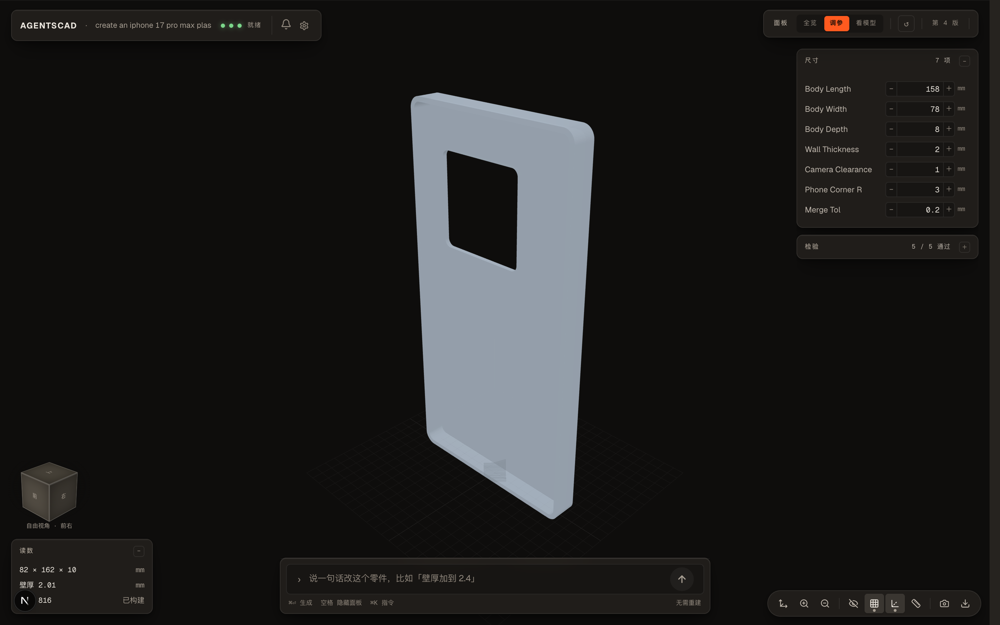
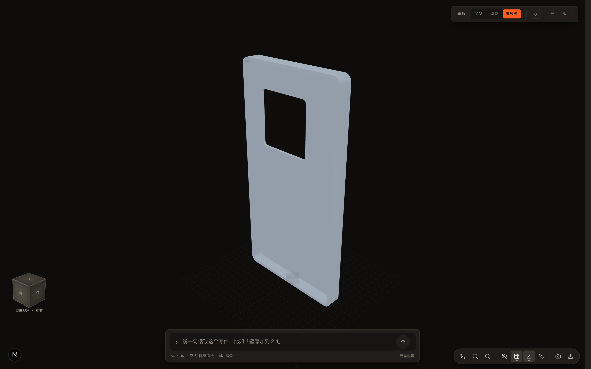
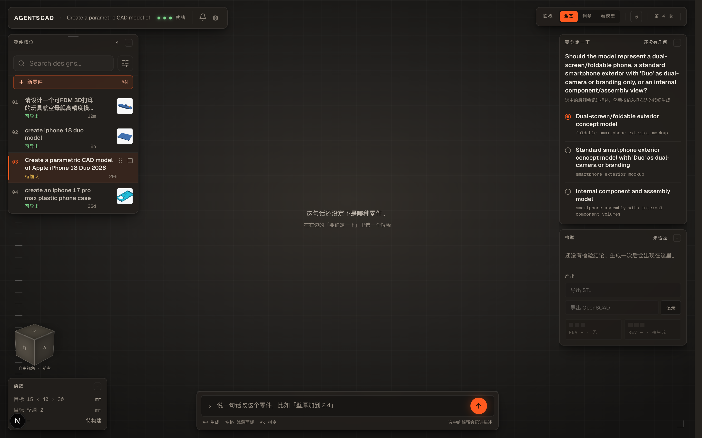
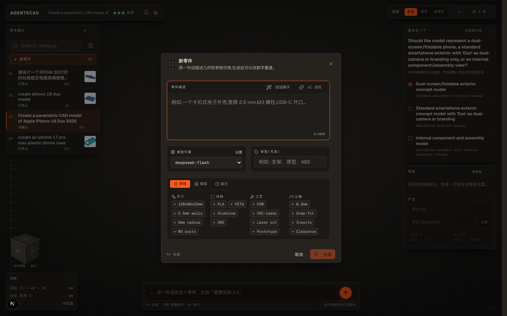

[English](./README.md) | **中文**

<p align="center">
  
</p>

<h1 align="center">AgentSCAD</h1>

<p align="center">
  <strong>AI 原生参数化 CAD 工作区 —— 自然语言生成可编辑 3D 模型与物理检验</strong>
</p>

<p align="center">
  
  
  
  
  
</p>

---

AgentSCAD 是一个**本地优先、开源的 AI 参数化 CAD 工作区**。采用精密工业测量台设计风格，拥有全画幅 3D 视口与悬浮仪表盘。只需在底部输入一句话，即可将自然语言需求转化为可编辑的 OpenSCAD 源码、高精度 3D 渲染几何、实测物理检验数据以及可直接用于 3D 打印的 STL 文件。

**在线体验 (Live Demo):** [https://agentscad.vercel.app](https://agentscad.vercel.app)

---

## 📸 界面预览


> **全新的精密工控仪表台设计**：
> - **全画幅 3D 视口**：沉浸式 WebGL 实时渲染，视角随心拖拽，彻底告别传统密集嵌套的侧边栏。
> - **悬浮仪表盘（Floating Modules）**：包含尺寸步进器（Steppers）、物理制造规则检验结论、实测读数等模块，可自由拖拽、折叠或隐藏。
> - **实体 ViewCube**：左下角 56px 实体定向立方体，覆盖 26 个标准观察视角，点击即转。
> - **极简单点输入**：底部中心输入框兼具提示词交互与生成控制，一个状态仅有一个核心动作。

---

## ⚡ 3 分钟快速上手

### 1. 启动应用

推荐使用 **Bun** 本地开发，也可以使用 **Docker Compose**：

```bash
# 克隆仓库
git clone https://github.com/Kevoyuan/AgentSCAD.git
cd AgentSCAD

# 安装依赖并初始化数据库
bun install
bun run db:push

# 启动开发服务器
bun run dev
```

> **或者使用 Docker Compose 一键启动：**
> ```bash
> cp .env.example .env
> docker compose up --build
> ```

浏览器访问 [http://localhost:3000](http://localhost:3000)。

### 2. 配置模型 Key

点击左上角仪表盘的 **设置图标 (⚙️)**：


- 选择你的供应商预设（如 **DeepSeek**、**OpenAI**、**OpenRouter**、**Anthropic**、**Gemini** 或 本地模型）。
- 粘贴你的 API Key，点击 **Test** 测试连接，再点击 **Save** 保存。
- *配置仅加密保存在本地 `.agentscad/` 目录或浏览器安全 Cookie 中，保护你的隐私。*

### 3. 生成你的第一个 3D 零件

在页面底部输入框中输入描述，例如：

```text
创建一个可壁挂的手机支架，带圆角和两个螺丝孔。
```

按下 `⌘ Enter`（或点击右侧橙色圆形按钮 `↑`），AgentSCAD 将全自动完成：
1. **意图解析**：提取尺寸、公差与制造特征；
2. **源码生成**：先用本地别名索引匹配你的描述（中英文一致），把关联的参考范例、设计模式与常见失败模式按相关度排序注入提示词，再编写规范的参数化 OpenSCAD 代码；
3. **真实渲染**：调用 OpenSCAD 引擎编译生成 STL 与 3D 网格；
4. **确定性物理检验**：严格检查流形闭合度、最小壁厚、最大外形等制造规则。

---

## 🎯 核心功能一览

### 1. 尺寸即时微调（Parametric Steppers）

生成完成后，右侧悬浮面板自动提取零件尺寸参数。通过加减步进器微调壁厚、开孔尺寸、长宽高等参数，点击重建立即获得最新模型。

| 尺寸微调模式 (调参) | 纯净视口模式 (看模型) |
| :---: | :---: |
|  |  |

### 2. 意图确认与智能消歧（“要你定一下”）

当描述存在多种工程可能时，系统不会胡乱猜测，而会浮出选择模块由你敲定方向后再生成，保证设计意图严谨可靠：

<p align="center">
  
</p>

### 3. 便捷的新零件设计面板（`⌘ N`）

支持点击左侧零件槽位的 `＋ 新零件` 按钮唤出工控面板，快速组合尺寸、材料（PLA/PETG/ABS）、工艺（FDM/CNC）与公差预设：

<p align="center">
  
</p>

---

## ⌨️ 常用快捷键速查

| 快捷键 | 功能操作 |
| :--- | :--- |
| `⌘ Enter` | 提交生成 / 立即重建 |
| `空格 (Space)` | **一键显隐悬浮仪表盘**（快速在全览与纯净模型视图间切换） |
| `⌘ N` | 快速新建零件设计 |
| `1` ~ `6` | 切换标准视图：前 (`1`)、右 (`2`)、上 (`3`)、后 (`4`)、左 (`5`)、下 (`6`) |
| `0` | 切换至默认等轴测视图 (Isometric) |
| `F` | 视口居中自适应 (Fit to View) |
| `⌘ K` | 打开快速指令面板 |

---

## 🛠️ 核心架构与原理

AgentSCAD 坚持**“几何事实由确定性工具说话，代码生成由大模型负责”**的原则：

- **OpenSCAD 几何引擎**：本地开发支持原生 OpenSCAD CLI；云端或无安装环境下支持官方固定的 OpenSCAD WebAssembly (WASM) 运行环境，开箱即用。
- **物理事实检验**：通过 Python / Trimesh 确定性分析 STL 网格数据，测量流形拓扑、外包围盒、壁厚及孔洞特征，绝不让 LLM 伪造通过状态。
- **确定性检索**：`cad_knowledge/retrieval-index.json` 是检索能力的唯一事实来源。请求与别名先做归一化（大小写、全角、标点），再按 strong / supporting 别名权重与特异度打分、确定性排序，并按分组预算截断。硬负例把易混家族分开——行星齿轮减速机构永远不会命中正齿轮条目。未命中的请求返回空上下文，而不是按文件名顺序凑数。这是词法检索，不是语义检索：没有向量索引，也不宣称有。
- **证据分层**：`DELIVERED` 只证明产物已经产出，不代表你接受了这个零件。追加写的 `JobOutcome` 账本记录 `accepted`、`rejected`、`user_edited`、`exported` 四类事件，只有当最近一次决策是 `accepted` 时，汇总结果才会给出 `taskSucceeded = true`；编辑与导出属于过程信号，永远不算成功。读取接口：`GET /api/jobs/{id}/outcome`。
- **本地优先持久化**：采用 SQLite 存储 `Job` 记录、`JobVersion` 历史与追加写的 `JobOutcome` 账本，产物持久化在本地文件系统，支持任意历史版本回溯与源码导出。

---

## 📋 常用开发命令

| 任务 | 命令 |
| :--- | :--- |
| 启动本地开发 | `bun run dev` |
| 构建生产包 | `bun run build` |
| 启动生产服务 | `bun run start` |
| 运行单元测试 | `bun run test` |
| 检查 WASM 编译引擎 | `bun run test:wasm` |
| 同步数据库结构 | `bun run db:push` |
| 重置开发数据库 | `bun run db:reset` |
| 运行 CAD 评估基准 | `bun run cad:eval:fast` |

---

## 📚 进阶文档

- [系统架构 (Architecture)](./docs/ARCHITECTURE.md)
- [技能与路由 (Skills & Routing)](./docs/SKILLS.md)
- [记忆与结果账本 (Memory & Outcomes)](./docs/MEMORY.md)
- [开发与 CI 指南 (Development & CI)](./docs/DEVELOPMENT.md)
- [CAD 评估与基准测试 (Benchmarking)](./docs/BENCHMARK.md)
- [OpenSCAD 库与环境策略 (Libraries)](./docs/OPENSCAD_LIBRARIES.md)
- [设计系统规范 (DESIGN.md)](./DESIGN.md)
- [更新日志 (Changelog)](./CHANGELOG.md)

---

## 📄 开源许可证

本项目基于 [MIT License](./LICENSE) 开源。
