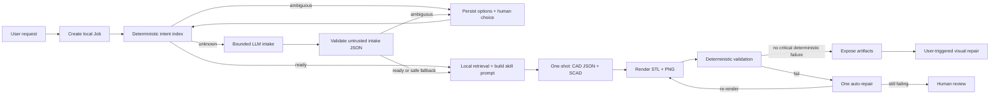

# AgentSCAD Architecture

AgentSCAD is a local-first, open-source parametric CAD web app. The default author/user flow has no account system: run the app, configure a model provider and API key, create jobs, and keep the job database, artifacts, and provider configuration on the local machine.

It is organized as an LLM-assisted CAD pipeline rather than a single prompt demo. Markdown skills guide model behavior; OpenSCAD is the core CAD execution engine; deterministic code owns side effects and measurable evidence.

## Stack

- **Frontend**: React 19 + Next.js 16 App Router + Tailwind CSS v4 + Shadcn UI
- **Backend API**: Next.js Route Handlers
- **Persistence**: SQLite and local artifacts by default; PostgreSQL and Vercel Blob are supported for the secondary hosted deployment mode
- **Runtime CAD dependency**: native OpenSCAD CLI locally, or the checksum-pinned official OpenSCAD WebAssembly Node CLI in serverless deployments

## Responsibility Boundaries

| Component | Responsible for | Must not be treated as |
|---|---|---|
| LLM + skills | Request interpretation, OpenSCAD generation/repair, chat, optional visual judgment | The source of truth for whether geometry compiled, is manifold, or meets measured dimensions |
| OpenSCAD | Compiling the generated program and producing actual geometry | Semantic proof that the result matches the user's intent |
| Deterministic validators | Compile/render status and supported measurable mesh/manufacturing checks | A complete aesthetic, functional, or user-acceptance evaluation |
| Human/user | Clarifying ambiguous intent and accepting or rejecting the result | An outcome that can be inferred from `DELIVERED` |

Provider API calls are the only remote AI dependency in the default local workflow. AgentSCAD itself does not require user registration, cloud object storage, or a multi-tenant account service.

## Repo Mental Model

| Layer | What it owns | Where to look |
|---|---|---|
| Agent workflow | Job state machine, retries, SSE progress, automatic workspace refresh | `src/lib/pipeline/`, `src/app/api/jobs/[id]/process/route.ts`, `src/app/api/cron/route.ts` |
| Skills | CAD reasoning contracts, repair strategy, validation review, library usage policy | `skills/scad-*`, `skills/RESOLVER.md` |
| Tools | Deterministic render, validation, SCAD sanitization, parameter extraction, artifact IO | `src/lib/tools/`, `scripts/validate_stl.py` |
| Repair | Validation-driven LLM repair, user-triggered VLM visual repair | `src/lib/repair/`, `src/app/api/jobs/[id]/repair/route.ts`, `src/app/api/jobs/[id]/visual-repair/route.ts` |
| Validation | Compile, bbox, component, hole count, mesh checks | `src/lib/validation/`, `src/lib/mesh-validator.ts`, `src/lib/visual-validator.ts` |
| Retrieval | Local keyword-based example retrieval for generation prompts | `src/lib/retrieval/`, `cad_knowledge/` |
| Std Library | Reusable OpenSCAD modules (plates, brackets, enclosures, fasteners) | `openscad_lib/agentscad_std.scad`, `openscad_lib/README.md` |
| Memory | Job state, version history, artifacts, learned patterns | `prisma/schema.prisma`, `src/lib/version-tracker.ts`, `src/lib/improvement-analyzer.ts` |
| Workspace UI | CAD viewport, job queue, parameter editing, visual repair button | `src/components/cad/`, `src/app/` |

## Runtime Workflow

```mermaid
flowchart LR
  A["User request"] --> B["Create local Job"]
  B --> IA["Deterministic intent index"]
  IA -->|unknown| MI["Bounded LLM intake"]
  MI --> IG["Validate untrusted intake JSON"]
  IA -->|ambiguous| IR["Persist options + human choice"]
  IG -->|ambiguous| IR
  IR --> IA
  IA -->|ready| C["Local retrieval + build skill prompt"]
  IG -->|ready or safe fallback| C
  C --> D["One-shot: CAD JSON + SCAD"]
  D --> E["Render STL + PNG"]
  E --> F["Deterministic validation"]
  F -->|no critical deterministic failure| G["Expose artifacts"]
  F -->|fail| H["One auto-repair"]
  H -->|re-render| E
  H -->|still failing| I["Human review"]
  G --> J["User-triggered visual repair"]
```

This diagram shows the current path. Intake first consults the versioned local intent index at zero model cost. For `行星发动机模型`, it distinguishes a science-fiction planetary propulsion megastructure from a planetary-gear motor/reduction mechanism, persists both options, and stops in `HUMAN_REVIEW` before any LLM/OpenSCAD call. Requests not covered by the index receive one bounded model intake pass through `skills/scad-intake/`; its JSON is treated as untrusted, normalized, size-limited, and downgraded to `UNKNOWN` when malformed. A model-discovered ambiguity uses the same persisted approval UI. The selected interpretation is recorded locally and injected as explicit generation input without rewriting the original request. A complete user-editable design-brief editor remains future work.

At runtime, `executeCadJob()` owns the state transitions:

| Stage | State / step | What happens |
|---|---|---|
| Intake | `NEW` / `intent_analyzed` | Analyze the local index first; for index-unknown requests run one bounded LLM intake and validate its output. Any supported ambiguity moves to `HUMAN_REVIEW` / `intent_clarification_required` before generation or rendering. |
| Intent approval | `HUMAN_REVIEW` → `NEW` | `POST /api/jobs/{id}/intent` validates a candidate, stores the explicit user approval, and lets the UI resume the same job. |
| Generation | `NEW` / `generating_llm` | Local example retrieval → one-shot structured CAD JSON + SCAD generation with standard library. |
| Source of truth | `SCAD_GENERATED` | Persist `scadSource`, `cadIntentJson`, `modelingPlanJson`, `validationTargetsJson`, parameter schema/values. |
| Rendering | `RENDERED` or `GEOMETRY_FAILED` | Run native OpenSCAD or the isolated WASM child process, then publish STL + PNG under `/artifacts/{jobId}/`. |
| Repair | `REPAIRING` | On validation failure: one auto-repair via LLM with validation feedback, re-render, re-validate. Caps at 1 repair. |
| Validation | `VALIDATED` or `HUMAN_REVIEW` | Deterministic checks: compile (C001), bbox (B001), components (C002), hole count (H001), mesh (R001-3). Visual validation (V001) is user-triggered only. |
| Delivery | `DELIVERED` | Mark pipeline completion and expose final STL, preview, SCAD, and report paths. This is artifact availability, not semantic acceptance. |

## Runtime Contracts

The HTTP process route is intentionally thin. `src/app/api/jobs/[id]/process/route.ts` validates request state and streams SSE frames, while `src/lib/pipeline/execute-cad-job.ts` owns the current runtime state machine.

Stable contracts:

- SSE uses raw `data: {json}\n\n` frames.
- Public artifacts stay under `/artifacts/{jobId}/`.
- Validation results keep the legacy `rule_id`, `rule_name`, `level`, `passed`, `is_critical`, `message` fields and may add explicit `status` (`PASS|WARN|FAIL|SKIP|ERROR|NOT_RUN`). A skipped or unavailable check is never counted as passed.
- Generated OpenSCAD source is the source of truth.
- Editable numeric parameters are extracted from top-level SCAD assignments.
- Model-provided parameter JSON is compatibility metadata and fallback, not the primary CAD representation.

Shared tools under `src/lib/tools/` handle rendering, validation, SCAD sanitization, OpenSCAD library resolution, artifact IO, and parameter extraction.

On Vercel, the official OpenSCAD WASM Node CLI runs as a separate child process
with a minimal environment, bounded memory/time/output, a fresh empty working
directory, and host filesystem access denied. It produces binary STL on
standard output; AgentSCAD projects that mesh into the PNG preview. Native
development continues to use `OPENSCAD_BIN` or `openscad`.

## Realtime Updates

Active generation progress is streamed to the browser through SSE. The broader workspace uses lightweight polling to keep job lists current without a separate realtime service.

When validation fails, AgentSCAD attempts one automatic LLM repair with validation feedback, then re-renders and re-validates. If the repair succeeds, the pipeline continues to delivery. If it fails, the job goes to HUMAN_REVIEW with artifacts preserved for inspection. Visual validation runs only when the user clicks "Visual Repair" after seeing the preview — it is not part of the default pipeline. The visual judge receives the request and rendered pixels, not SCAD source or generation rationale; after a visual repair it evaluates the repaired preview again before reporting the result.

## Persistence and Isolation

| Deployment | Jobs/history | Artifacts | Provider settings |
|---|---|---|---|
| Local/default | Prisma SQLite | Local filesystem | `.agentscad/providers.json` in the checkout; contains API keys and should not be shared or committed |
| Vercel/hosted | PostgreSQL through the generated Prisma schema | Vercel Blob | Encrypted HttpOnly browser-session cookie when `PROVIDER_SETTINGS_SECRET` is configured; otherwise provider settings are read-only and no shared credential is used in public mode |

There is no account/organization model. Without `API_SECRET`, production browser access is limited to same-origin requests, jobs are scoped with an HttpOnly browser-session token, and environment/file-backed provider credentials are disabled. Public hosted use therefore requires encrypted per-browser BYO keys through `PROVIDER_SETTINGS_SECRET`. This is lightweight isolation for a local/simple hosted app, not an identity or tenancy system. `API_SECRET` is an optional bearer-token administrative access path for private deployments that intentionally use shared environment providers.

## Evaluation and Memory Status

- The offline evaluator records tagged `PASS|FAIL|SKIP|ERROR|NOT_RUN` evidence and never promotes unexecuted geometry checks. It directly exercises the shared deterministic intake analyzer but does not call an LLM or OpenSCAD. The separate real-render benchmark proves only its named compile/STL/bbox/PNG facts; neither mode implies model or semantic quality. See [Benchmarking](./BENCHMARK.md).
- Static skills/examples are reviewed knowledge. Unmatched retrieval returns honest empty design context. The append-only learned-observation path is experimental and global to a checkout; prompt injection is off by default and cannot run in production. See [Memory](./MEMORY.md).
- `DELIVERED`, deterministic validation, optional visual judgment, and explicit user acceptance are separate evidence levels and should remain separate in future schemas and reports.

## Related Docs

- [Development and CI](./DEVELOPMENT.md)
- [Benchmarking](./BENCHMARK.md)
- [Memory](./MEMORY.md)
- [Skills](./SKILLS.md)
- [OpenSCAD libraries](./OPENSCAD_LIBRARIES.md)
- [Troubleshooting](./TROUBLESHOOTING.md)
